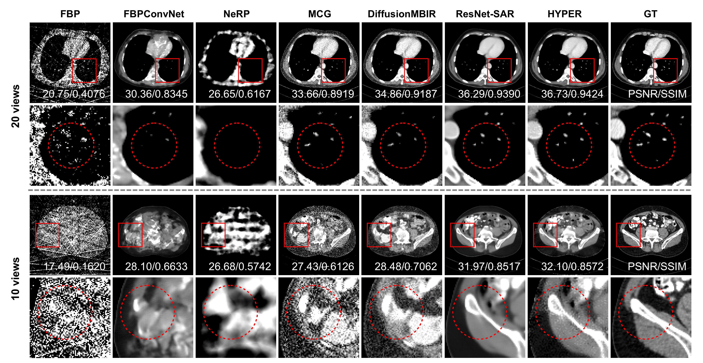

# HYPER : **Hybrid Framework Combining Iterative Pre-Trained Supervised Image Priors with Neural Representation for Extremely Sparse-view CT Reconstruction**

HYPER is a hybrid framework for extremely sparse-view CT reconstruction. It iteratively update between pre-trained ResNets and Streak Artifact Removal (ResNet-SAR) to suppress streak artifacts and restore fine anatomical details, generating a high-quality image prior. This prior is then embedded into an implicit neural representation (INR) and refined using measured sparse-view projections to improve data consistency.

## Representative Results

Qualitative comparison with existing methods under 20-view and 10-view conditions with Poisson–Gaussian noise ($I_0 = 10^5$, $v = 0.05$) on the AAPM dataset. The top row shows 20-view reconstructions, and the bottom row shows 10-view reconstructions. Zoomed-in regions of interest (ROIs) are displayed below each reconstruction to highlight fine structural details.

## Code Availability

The code will be released in this repository soon.
